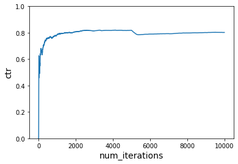

# Simulating Content Personalization with Contextual Bandits 

In the first [Contextual Bandits Reinforcement Learning](contextual_bandits.html) tutorial, we learned about this approach to reinforcement learning with Vowpal Wabbit and contextual bandit algorithms. In this tutorial, we simulate a content personalization scenario with Vowpal Wabbit using contextual bandits to make choices between actions in a given context. The goal is to maximize user engagement as quantified by measuring the expected reward — click-through rate (CTR).

In a contextual bandit setting, a data point has four components:

- Context
- Action
- Probability of choosing the action
- Reward/cost for the chosen action

We need to generate a context in our simulator to get an action/decision for the given context, and to simulate generating a reward. The goal of the simulator is to maximize reward (CTR) — or minimize loss (-CTR).

The **context** is therefore (user, time_of_day):

- We have two website visitors: "Tom" and "Anna."
- Tom and Anna visit the website in the morning or the afternoon.

We have the option of recommending a variety of articles to Tom and Anna. Therefore, the **actions** are the different choices of articles: "politics", "sports", "music", "food", "finance", "health", or "cheese."

The **reward** is whether they click on the article or not: "click" or "no click."

## Getting started

Import the following packages to build this simulation in Python:

```python
from vowpalwabbit import pyvw
import random
import matplotlib.pyplot as plt
```

## Simulating reward for Vowpal Wabbit

In the real world, we must learn Tom and Anna's preferences for articles as we observe their interactions. Since this is a simulation, we must define Tom and Anna's preference profile. 

The reward that we provide to the learner follows this preference profile. We hope to see if the learner can make better and better decisions as we see more samples, which in turn means we are maximizing the reward.

To accomplish this, we need to modify the reward function in a few different ways and see if the contextual bandit learner picks up the changes. Then, we compare the CTR with and without learning.

Vowpal Wabbit optimizes to minimize cost, which is negative of reward. 

Therefore, **we always pass negative of reward as cost to Vowpal Wabbit.**

```python
# VW tries to minimize loss/cost, therefore we will pass cost as -reward
USER_LIKED_ARTICLE = -1.0
USER_DISLIKED_ARTICLE = 0.0
```
The reward function below specifies that Tom likes politics in the morning and music in the afternoon. Anna likes sports in the morning and politics in the afternoon. It looks dense, but we are simulating a hypothetical world in the format of the feedback the learner understands — cost.

If the learner recommends an article that aligns with the reward function, we give a positive reward. In our simulation, this is a click:

```python
def get_cost(context,action):
    if context['user'] == "Tom":
        if context['time_of_day'] == "morning" and action == 'politics':
            return USER_LIKED_ARTICLE
        elif context['time_of_day'] == "afternoon" and action == 'music':
            return USER_LIKED_ARTICLE
        else:
            return USER_DISLIKED_ARTICLE
    elif context['user'] == "Anna":
        if context['time_of_day'] == "morning" and action == 'sports':
            return USER_LIKED_ARTICLE
        elif context['time_of_day'] == "afternoon" and action == 'politics':
            return USER_LIKED_ARTICLE
        else:
            return USER_DISLIKED_ARTICLE
```

## Understanding Vowpal Wabbit format

There are steps we need to take to set up our input in a format Vowpal Wabbit understands. 

This function handles converting from our context as a dictionary, list of articles, and the cost if there is one into the text format it understands:

```python
# This function modifies (context, action, cost, probability) to VW friendly format
def to_vw_example_format(context, actions, cb_label = None):
    if cb_label is not None:
        chosen_action, cost, prob = cb_label
    example_string = ""
    example_string += "shared |User user={} time_of_day={}\n".format(context["user"], context["time_of_day"])
    for action in actions:
        if cb_label is not None and action == chosen_action:
            example_string += "0:{}:{} ".format(cost, prob)
        example_string += "|Action article={} \n".format(action)
    #Strip the last newline
    return example_string[:-1]
```

To make sense of this format, we go through an example. In this example, the time of day is morning, and the user is Tom. There are four possible articles. 

In Vowpal Wabbit format, there is one line that starts with shared-the shared context-followed by four lines each corresponding to an article:

```python
context = {"user":"Tom","time_of_day":"morning"}
actions = ["politics", "sports", "music", "food"]

print(to_vw_example_format(context,actions))
```

**Output:**
<div class="output" markdown="1">
shared |User user=Tom time_of_day=morning
|Action article=politics
|Action article=sports
|Action article=music
|Action article=food
</div>

## Getting a decision from Vowpal Wabbit

When we call Vowpal Wabbit, the output is a [probability mass function](https://en.wikipedia.org/wiki/Probability_mass_function){:target="blank"} (PMF). Vowpal Wabbit provides a list of probabilities over the set of actions because we are incorporating exploration into our strategy. This exploration means that the probability at a given index in the list corresponds to the likelihood of picking that specific action. 

To arrive at a decision/action, we must sample from this list.

For example, given the list **[0.7, 0.1, 0.1, 0.1]**, we would choose the first item with a 70% chance. The command `sample_custom_pmf` takes such a list and gives us the index it chose and what the probability of choosing that index was.

```python
def sample_custom_pmf(pmf):
    total = sum(pmf)
    scale = 1 / total
    pmf = [x * scale for x in pmf]
    draw = random.random()
    sum_prob = 0.0
    for index, prob in enumerate(pmf):
        sum_prob += prob
        if(sum_prob > draw):
            return index, prob
```

We have all the information we need to choose an action for a specific user and context. Use Vowpal Wabbit to achieve this with the following steps:

1. Convert the context and actions into the text format needed.
2. Pass this example to Vowpal Wabbit and get the PMF output.
3. Sample this PMF to get the article to show.
4. Return the chosen article and the probability of choosing it. 

>**Note:** We need the probability when we learn from this example.

```python
def get_action(vw, context, actions):
    vw_text_example = to_vw_example_format(context,actions)
    pmf = vw.predict(vw_text_example)
    chosen_action_index, prob = sample_custom_pmf(pmf)
    return actions[chosen_action_index], prob
```

## Reinforcement learning simulation

Now that we have done all of the setup work and we know how to interface with Vowpal Wabbit let’s simulate the world of Tom and Anna. The scenario is as follows: Tom and Anna go to a website and are shown an article. Remember that the reward function allows us to define the real-world reaction to the content that Vowpal Wabbit recommends.

We choose between Tom and Anna uniformly at random and choose the time of day they visit the site uniformly at random. Think of this as flipping a coin to choose between Tom and Anna and flipping the coin again to choose the time of day.

```python
users = ['Tom', 'Anna']
times_of_day = ['morning', 'afternoon']
actions = ["politics", "sports", "music", "food", "finance", "health", "camping"]

def choose_user(users):
    return random.choice(users)

def choose_time_of_day(times_of_day):
    return random.choice(times_of_day)
```

### Instantiate learner

We instantiate a contextual bandit learner in Vowpal Wabbit and then simulate Tom and Anna's website visits num_iterations number of times. With each visit, we do the following:

1. Decide between Tom and Anna
2. Decide the time of day
3. Pass context (i.e., user, time of day) to the learner to get action (i.e., article recommendation, and the probability of choosing action).
4. Receive reward (i.e., see if the user clicked or not). Remember that cost is just a negative reward.
5. Format context, action, probability, reward in Vowpal Wabbit format
6. Learn from the example

>**Note:** Vowpal Wabbit reduces a contextual bandit problem to a cost-sensitive multiclass classification problem.

This reduction is the same for every one of our simulations, so we define the process in the `run_simulation` function. We have to supply the cost function to simulate how the real world works:

```python
def run_simulation(vw, num_iterations, users, times_of_day, actions, cost_function, do_learn = True):
    cost_sum = 0.
    ctr = []

    for i in range(1, num_iterations+1):
        # 1. In each simulation choose a user
        user = choose_user(users)
        # 2. Choose time of day for a given user
        time_of_day = choose_time_of_day(times_of_day)

        # 3. Pass context to vw to get an action
        context = {'user': user, 'time_of_day': time_of_day}
        action, prob = get_action(vw, context, actions)

        # 4. Get cost of the action we chose
        cost = cost_function(context, action)
        cost_sum += cost

        if do_learn:
            # 5. Inform VW of what happened so we can learn from it
            vw_format = vw.parse(to_vw_example_format(context, actions, (action, cost, prob)),pyvw.vw.lContextualBandit)
            # 6. Learn
            vw.learn(vw_format)

        # We negate this so that on the plot instead of minimizing cost, we are maximizing reward
        ctr.append(-1*cost_sum/i)

    return ctr
```

We want to be able to visualize what is occurring, so we are going to plot the click-through rate over each iteration of the simulation. The CTR is higher if Vowpal Wabbit is showing actions that get rewards. Use this utility function to make showing the plot easier:

```python
def plot_ctr(num_iterations, ctr):
    plt.plot(range(1,num_iterations+1), ctr)
    plt.xlabel('num_iterations', fontsize=14)
    plt.ylabel('ctr', fontsize=14)
    plt.ylim([0,1])
```

## First scenario

First, we use the first reward function `get_cost` and assume that Tom and Anna do not change their preferences over time to see what happens to user engagement as we learn. Then, we see what happens when there is no learning. We use the no learning case as our baseline comparison.

### With learning

```python
# Instantiate learner in VW
vw = pyvw.vw("--cb_explore_adf -q UA --quiet --epsilon 0.2")

num_iterations = 5000
ctr = run_simulation(vw, num_iterations, users, times_of_day, actions, get_cost)

plot_ctr(num_iterations, ctr)
```


#### Interactions

You’ll notice that we include `-q UA` in the arguments we supply to Vowpal Wabbit. This step tells Vowpal Wabbit to create additional features, which are the features in the (U)ser namespace and (A)ction namespaces multiplied together. Doing so allows us to learn the interaction between when specific actions are good at certain times of days and for specific users.

If we didn’t include `-q UA`, the learning would not work. We can see that in the following action:

```python
# Instantiate learner in VW but without -q
vw = pyvw.vw("--cb_explore_adf --quiet --epsilon 0.2")

num_iterations = 5000
ctr = run_simulation(vw, num_iterations, users, times_of_day, actions, get_cost)

plot_ctr(num_iterations, ctr)
```


### Without learning

Let’s do the same thing again, but with `-q`. This step shows the effect if we don’t learn from what happens. The CTR never improves, and we hover around 0.2.

```python
# Instantiate learner in VW
vw = pyvw.vw("--cb_explore_adf -q UA --quiet --epsilon 0.2")

num_iterations = 5000
ctr = run_simulation(vw, num_iterations, users, times_of_day, actions, get_cost, do_learn=False)

plot_ctr(num_iterations, ctr)
```


## Second scenario

People’s preferences change over time in the real world. To account for this in the simulation, we incorporate two different cost functions and swap over to the second one halfway through.

The following table represents the new reward function `get_cost_1`:

### Tom

| | **get_cost** | **get_cost_new1** |
|:---|:---:|:---:|
| **Morning** | Politics | Politics |
| **Afternoon** | Music | Sports |

### Anna

| | **get_cost** | **get_cost_new1**  |
|:---|:---:|:---:|
| **Morning** | Sports | Sports |
| **Afternoon** | Politics | Sports |

This reward function is still working with the previous learner actions:

```python
def get_cost_new1(context,action):
    if context['user'] == "Tom":
        if context['time_of_day'] == "morning" and action == 'politics':
            return USER_LIKED_ARTICLE
        elif context['time_of_day'] == "afternoon" and action == 'sports':
            return USER_LIKED_ARTICLE
        else:
            return USER_DISLIKED_ARTICLE
    elif context['user'] == "Anna":
        if context['time_of_day'] == "morning" and action == 'sports':
            return USER_LIKED_ARTICLE
        elif context['time_of_day'] == "afternoon" and action == 'sports':
            return USER_LIKED_ARTICLE
        else:
            return USER_DISLIKED_ARTICLE
```

To make it easy to show the effect of the cost function changing, we modify the `run_simulation` function. It is a little less readable, but it supports accepting a list of cost functions, and it operates over each cost function in turn.

This change is perfect for our scenario:

```python
def run_simulation_multiple_cost_functions(vw, num_iterations, users, times_of_day, actions, cost_functions, do_learn = True):
    cost_sum = 0.
    ctr = []

    start_counter = 1
    end_counter = start_counter + num_iterations
    for cost_function in cost_functions:
        for i in range(start_counter, end_counter):
            # 1. in each simulation choose a user
            user = choose_user(users)
            # 2. choose time of day for a given user
            time_of_day = choose_time_of_day(times_of_day)

            # Construct context based on chosen user and time of day
            context = {'user': user, 'time_of_day': time_of_day}

            # 3. Use the get_action function we defined earlier
            action, prob = get_action(vw, context, actions)

            # 4. Get cost of the action we chose
            cost = cost_function(context, action)
            cost_sum += cost

            if do_learn:
                # 5. Inform VW of what happened so we can learn from it
                vw_format = vw.parse(to_vw_example_format(context, actions, (action, cost, prob)),pyvw.vw.lContextualBandit)
                # 6. Learn
                vw.learn(vw_format)

            # We negate this so that on the plot instead of minimizing cost, we are maximizing reward
            ctr.append(-1*cost_sum/i)
        start_counter = end_counter
        end_counter = start_counter + num_iterations

    return ctr
```

### With learning

Now, we switch to the second reward function after a few samples (running the first reward function). Recall that this reward function changes the preferences of web users, but it is still working with the same action space as before. We should see the learner pick up these changes and optimize the new preferences.

```python
# use first reward function initially and then switch to second reward function

# Instantiate learner in VW
vw = pyvw.vw("--cb_explore_adf -q UA --quiet --epsilon 0.2")

num_iterations_per_cost_func = 5000
cost_functions = [get_cost, get_cost_new1]
total_iterations = num_iterations_per_cost_func * len(cost_functions)

ctr = run_simulation_multiple_cost_functions(vw, num_iterations_per_cost_func, users, times_of_day, actions, cost_functions)

plot_ctr(total_iterations, ctr)
```


> **Note:** The initial spike in CTR depends on the rewards received for the first few examples. When you run on your own, you may see something different initially because our simulator is designed to have randomness.

### Without learning

We repeat this step without learning to demonstrate the effect:

```python
# Do not learn
# use first reward function initially and then switch to second reward function

# Instantiate learner in VW
vw = pyvw.vw("--cb_explore_adf -q UA --quiet --epsilon 0.2")

num_iterations_per_cost_func = 5000
cost_functions = [get_cost, get_cost_new1]
total_iterations = num_iterations_per_cost_func * len(cost_functions)

ctr = run_simulation_multiple_cost_functions(vw, num_iterations_per_cost_func, users, times_of_day, actions, cost_functions, do_learn=False)
plot_ctr(total_iterations, ctr)
```


## Third scenario

In the final scenario, we start rewarding actions that have never seen a reward previously when we change the cost function:

### Tom

| | **get_cost** | **get_cost_new2** |
|:---|:---:|:---:|
| **Morning** | Politics |  Politics|
| **Afternoon** | Music |   Food |

### Anna

| | **get_cost** | **get_cost_new2** |
|:---|:---:|:---:|
| **Morning** | Sports | Food|
| **Afternoon** | Politics |  Food |


```python
def get_cost_new2(context,action):
    if context['user'] == "Tom":
        if context['time_of_day'] == "morning" and action == 'politics':
            return USER_LIKED_ARTICLE
        elif context['time_of_day'] == "afternoon" and action == 'food':
            return USER_LIKED_ARTICLE
        else:
            return USER_DISLIKED_ARTICLE
    elif context['user'] == "Anna":
        if context['time_of_day'] == "morning" and action == 'food':
            return USER_LIKED_ARTICLE
        elif context['time_of_day'] == "afternoon" and action == 'food':
            return USER_LIKED_ARTICLE
        else:
            return USER_DISLIKED_ARTICLE
```

### With learning

Now, we switch to the third reward function after a few samples (running the first reward function). Remember that this reward function changes the preferences of the users. It is working with a **different** action space than before. We should see the learner pick up these changes and optimize the new preferences.

```python
# use first reward function initially and then switch to third reward function

# Instantiate learner in VW
vw = pyvw.vw("--cb_explore_adf -q UA --quiet --epsilon 0.2")

num_iterations_per_cost_func = 5000
cost_functions = [get_cost, get_cost_new2]
total_iterations = num_iterations_per_cost_func * len(cost_functions)

ctr = run_simulation_multiple_cost_functions(vw, num_iterations_per_cost_func, users, times_of_day, actions, cost_functions)

plot_ctr(total_iterations, ctr)
```



### Without Learning

Finally, we repeat the steps wihout learning to see the effects:

```python
# Do not learn
# use first reward function initially and then switch to third reward function

# Instantiate learner in VW
vw = pyvw.vw("--cb_explore_adf -q UA --quiet --epsilon 0.2")

num_iterations_per_cost_func = 5000
cost_functions = [get_cost, get_cost_new2]
total_iterations = num_iterations_per_cost_func * len(cost_functions)

ctr = run_simulation_multiple_cost_functions(vw, num_iterations_per_cost_func, users, times_of_day, actions, cost_functions, do_learn=False)

plot_ctr(total_iterations, ctr)
```


## Summary

This contextual bandit tutorial showcases a real-world simulation scenario for using the contextual bandit approach to reinforcement learning. We take a context and a set of actions and learn what actions worked best for a given context. The result is that the learner responds rapidly to real-world changes. We showed that allowing the learner to interact with the world resulted in higher rewards than the "without learning" baseline.

This tutorial worked with simplistic features. VW supports high dimensional sparse features, [different exploration algorithms and policy evaluation approaches](contextual_bandits.html#algorithms-and-format).
