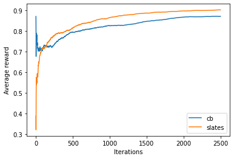

# Combinatorial Bandits

A common setting when using bandits is the desire to make multiple decisions jointly as each individual decision could impact the outcome of the others. For example, when optimizing the layout of a web page, you have a list of context boxes to decide upon, one usually only has whole-page metrics so the impact of all decisions are intertwined.

One way to address this is, instead of making multiple decisions for each box, is make single decision with a combinatorial number of arms to cover every combination of individual decisions. This combinatorial explosion in the number of arms make traditional Contextual Bandits methods such as IPS (Inverse Propensity Score) untractable and requiring a large amount of data.

# The SLATES problem setting

The SLATES<sup></sup> setting is an extension to the Contextual Bandits one. With SLATES, there's a set of slots (a slot is akin to a decision) and each slot has a set of associated actions. When making a decision, an action is selected for each slot based on the policy and which slot they are associated with.

A single, global, reward is produced that signals the outcome of an entire slate of decisions. There's a linearity assumption on the impact of each action on the observed reward.


# Vowpal Wabbit SLATES example format

```
slates shared | a
slates action 0 | a
slates action 0 | b
slates action 0 | c
slates action 1 | d
slates action 1 | e
slates slot | x
slates slot | y
```

`slates shared` is the shared context by the decision.
Each `slates action` needs to tell which slot they are associated with, slots are 0-indexed.
Finally, `slates slot` is used to list the features of each slot.


# Example

## Scenario

In this example our goal is to select the best outfit for the ocasion.

The shared context represents the ocasion, in our example it's either `corporate` or `trade`
Each slot represent the clothing type, here it will be `torso`, `legs` and `footwear`
The clothing items are represented by each action.
The reward is how suitable an outfit choice is for a given ocasion.

We will compare using SLATES with CB to see its effectiveness.

## Part One - setup

Let's start by importing the python libraries we'll use in this example:

```python
from vowpalwabbit import pyvw
import matplotlib.pyplot as plt
import pandas as pd
import random
import math
import numpy as np
```

Now, the simulator parameters.

```python
NUM_ITERATIONS = 2500
shared_contexts = ["corporate", "trade"]
torso_items = ["tshirt", "buttonupshirt", "highvis"]
legs_items = ["workpants", "formalpants", "shorts"]
feet_items = ["formalshoes", "runners", "flipflops", "boots"]
```

## Part two - reward and example creation

Our reward function receives as arguments the shared context (the ocasion) and the select actions for each slot (the types of clothing).
In order to reflect real world problems, and make it more dificult, we inject normal noise in the reward value.

```python
def reward_function(shared_context, torso_index, legs_index, feet_index):    
    if shared_context == "corporate":
        torso_values = [noise(0.2), noise(0.3), noise(0.1)]
        legs_val = [noise(0.1), noise(0.3), noise(0.2)]    
        feet_values = [noise(0.4), noise(0.3), noise(0.05), noise(0.1)]
    if shared_context == "trade":
        torso_values = [noise(0.15), noise(0.2), noise(0.3)]
        legs_val = [noise(0.4), noise(0.2), noise(0.35)]    
        feet_values = [noise(0.15), noise(0.2), noise(0.1), noise(0.3)]
    
    return torso_values[torso_index] + legs_val[legs_index] + feet_values[feet_index]
```

The following piece of code generate examples that will be used for inference and training:
```python
def generate_slates_text_format(shared_context):
    return [
       f"slates shared |User {shared_context}",
        "slates action 0 |Action tshirt", 
        "slates action 0 |Action buttonupshirt", 
        "slates action 0 |Action highvis", 
        "slates action 1 |Action workpants", 
        "slates action 1 |Action formalpants", 
        "slates action 1 |Action shorts", 
        "slates action 2 |Action formalshoes", 
        "slates action 2 |Action runners", 
        "slates action 2 |Action flipflops", 
        "slates action 2 |Action boots", 
        "slates slot |Slot torso", 
        "slates slot |Slot legs",
        "slates slot |Slot feet"
    ]

def generate_slates_text_format_with_label(shared_context, reward, chosen_torso_index, chosen_torso_prob, chosen_legs_index, chosen_legs_prob, chosen_feet_index, chosen_feet_prob):
    return [
       f"slates shared {-1*reward} |User {shared_context}",
        "slates action 0 |Action tshirt", 
        "slates action 0 |Action buttonupshirt", 
        "slates action 0 |Action highvis", 
        "slates action 1 |Action workpants", 
        "slates action 1 |Action formalpants", 
        "slates action 1 |Action shorts", 
        "slates action 2 |Action formalshoes", 
        "slates action 2 |Action runners", 
        "slates action 2 |Action flipflops", 
        "slates action 2 |Action boots", 
        f"slates slot {chosen_torso_index}:{chosen_torso_prob} |Slot torso", 
        f"slates slot {chosen_legs_index}:{chosen_legs_prob} |Slot legs",
        f"slates slot {chosen_feet_index}:{chosen_feet_prob} |Slot feet"

    ]
```

## Part three - simulator

Let's create the `pyvw` instance we'll use with this simulator 

```python
slates_vw = pyvw.vw("--slates --epsilon 0.2 --interactions SA UAS US UA -l 0.05 --power_t 0")
```

Notice we're passing `--slates` which enable usage of the SLATES algorith. For an explanation of the other arguments, go back to the
[Command Line Tutorial](md_first_steps.html).

Now, the core simulation loop:

```python

slates_rewards = []
for _ in range(NUM_ITERATIONS):
    shared_context = random.choice(shared_contexts)
    slates_prediction = slates_vw.predict(generate_slates_text_format(shared_context))
    torso_index, torso_prob = slates_prediction[0][0]
    legs_index, legs_prob = slates_prediction[1][0]    
    feet_index, feet_prob = slates_prediction[2][0]
    reward = reward_function(shared_context, torso_index, legs_index, feet_index)
    slates_rewards.append(reward)
    slates_vw.learn(generate_slates_text_format_with_label(shared_context,reward, torso_index, torso_prob, legs_index, legs_prob, feet_index, feet_prob))

slates_vw.finish()
```

# Part four - Contextual Bandits

Let's try to solve the same problem by using CB with combinatorial actions:

```python
def generate_combinations(shared_context, torso_items, legs_items, feet_items):
    examples = [f"shared |User {shared_context}"]
    descriptions = []
    for i, torso in enumerate(torso_items):
        for j, legs in enumerate(legs_items):
            for k, feet in enumerate(feet_items):
                examples.append(f"|Action torso={torso} legs={legs} feet={feet}")
                descriptions.append((i,j,k))
                
    return examples, descriptions

def sample_custom_pmf(pmf):
    total = sum(pmf)
    scale = 1 / total
    pmf = [x * scale for x in pmf]
    draw = random.random()
    sum_prob = 0.0
    for index, prob in enumerate(pmf):
        sum_prob += prob
        if(sum_prob > draw):
            return index, prob

cb_vw = pyvw.vw("--cb_explore_adf --epsilon 0.2 --interactions AA AU AAU -l 0.05 --power_t 0")

cb_rewards = []
for _ in range(NUM_ITERATIONS):
    shared_context = random.choice(shared_contexts)
    examples, indices = generate_combinations(shared_context, torso_items, legs_items, feet_items)
    cb_prediction = cb_vw.predict(examples)
    chosen_index, prob = sample_custom_pmf(cb_prediction)
    torso_index, legs_index, feet_index = indices[chosen_index]
    reward = reward_function(shared_context, torso_index, legs_index, feet_index)
    cb_rewards.append(reward)
    examples[chosen_index + 1]= f"0:{-1*reward}:{prob} {examples[chosen_index + 1]}"
    cb_vw.learn(examples)

cb_vw.finish()
```

## Part five - compare results


Let's plot the two runs so we can compare the result:

```python
plt.plot(pd.Series(cb_rewards).expanding().mean())
plt.plot(pd.Series(slates_rewards).expanding().mean())
plt.xlabel('Iterations')
plt.ylabel('Average reward')
plt.legend(['cb', 'slates'])
```



As we can see, SLATES learns a better policy with lower regret.

# Summary

In this tutorial, we learned what SLATES , how to use it with VW and how it compares to solving the same problem with Contextual Bandits.
For further information, visit the following links:

- [Slate input format](https://github.com/VowpalWabbit/vowpal_wabbit/wiki/Slates)
- [Examples from the original publication](https://github.com/adith387/slates_semisynth_expts)


